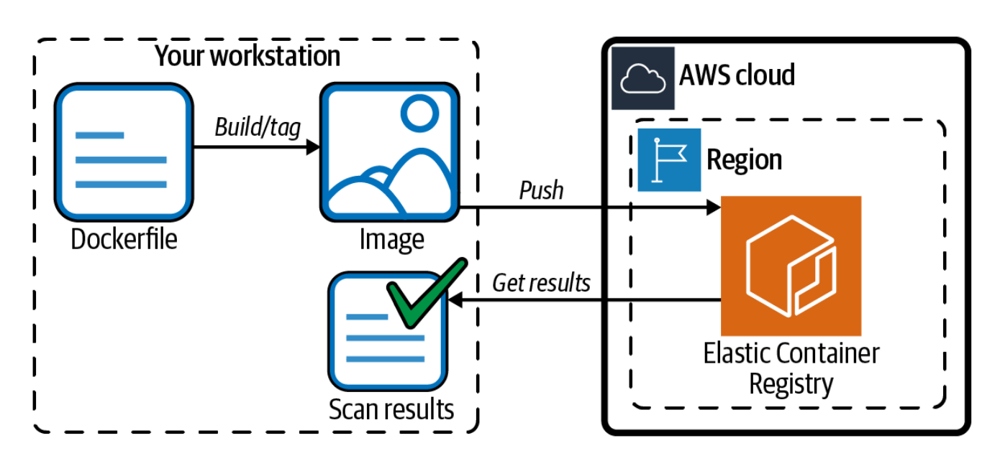

# Automatically Scanning Images in ECR for Security 

## Problem
You want to automatically scan your container images for security vulnerabilities each time you push to a repository.

## Solution
Enable automatic image scanning on a repository in Amazon ECR, push an image, and observe the scan results, as shown in Figure 6-5.



## Prerequisite
* ECR repository

## Preparation 
### Create an ECR repository:
```
aws ecr create-repository --repository-name aws-cookbook-repo
```

## Steps
1. Rather than building a new container image from a Dockerfile (as you did in Recipe 6.1), this time you are going to pull an old NGINX container image:
```
docker pull nginx:1.14.1
```
2. On the command line, apply the scanning configuration to the repository you created:
```
REPO=aws-cookbook-repo && \
    aws ecr put-image-scanning-configuration \
    --repository-name $REPO \
    --image-scanning-configuration scanOnPush=true
```
3. Get Docker login information:
```
aws ecr get-login-password | docker login --username AWS \
    --password-stdin $AWS_ACCOUNT_ID.dkr.ecr.$AWS_REGION.amazonaws.com
```
4. Apply a tag to the image so that you can push it to the ECR repository:
```
docker tag nginx:1.14.1 \
    $AWS_ACCOUNT_ID.dkr.ecr.$AWS_REGION.amazonaws.com/aws-cookbook-repo:old
```
5. Push the image:
```
docker push \
    $AWS_ACCOUNT_ID.dkr.ecr.$AWS_REGION.amazonaws.com/aws-cookbook-repo:old
```

## Validation checks
Shortly after the push is complete, you can examine the results of the security scan of the image in JSON format:
```
aws ecr describe-image-scan-findings \
    --repository-name aws-cookbook-repo --image-id imageTag=old
```
You should see output similar to the following:
```
{
      "imageScanFindings": {
        "findings": [
          {
            "name": "CVE-2019-3462",
            "description": "Incorrect sanitation of the 302 redirect field in HTTP
    transport method of apt versions 1.4.8 and earlier can lead to content injection by
    a MITM attacker, potentially leading to remote code execution on the target
    machine.",
            "uri": "https://security-tracker.debian.org/tracker/CVE-2019-3462",
            "severity": "CRITICAL",
            "attributes": [
              {
                "key": "package_version",
                "value": "1.4.8"
},
```

## Clean up
### Delete the image from your local machine
```
docker image rm \
$AWS_ACCOUNT_ID.dkr.ecr.$AWS_REGION.amazonaws.com/aws-cookbook-repo:old
docker image rm nginx:1.14.1
```

### Delete the image from ECR:
```
aws ecr batch-delete-image --repository-name aws-cookbook-repo \
 --image-ids imageTag=old
 ```

### Delete the repository:
`aws ecr delete-repository --repository-name aws-cookbook-repo`

## Discussion
The [Common Vulnerabilities and Exposures (CVEs)](https://cve.mitre.org/) database from the open source [Clair project](https://github.com/quay/clair) is used by Amazon ECR for [vulnerability scanning](https://docs.aws.amazon.com/AmazonECR/latest/userguide/image-scanning.html). You are provided a Common Vulnerability Scoring System (CVSS) score to indicate the severity of any detected vulnerabilities. This helps you detect and remediate vulnerabilities in your container image. You can configure alerts for newly discovered vulnerabilities in images by using Amazon EventBridge and Amazon Simple Notification Service (Amazon SNS).

> WARNING: The scanning feature does not continuously scan your images, so it is important to push your image versions routinely (or trigger a manual scan).

You can retrieve the results of the last scan for an image at any time with the com‐ mand used in the last step of this recipe. Furthermore, you can use these commands as part of an automated CI/CD process that may validate whether or not an image has a certain CVSS score before deploying.

### Challenge 1
Remediate the vulnerability by updating the image with the latest NGINX container image.

### Challenge 2
Configure an SNS topic to send you an email when vulnerabilities are detected in your repository.
