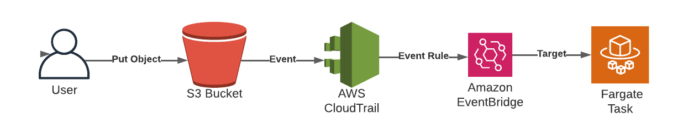

# Launching a Fargate container task in response to an event

## Problem
You need to launch a container task to process incoming files.



### Prerequisites
* Amazon Virtual Private Cloud (VPC) with isolated or private subnets and associated route tables
* Two Simple Storage Service (S3) Buckets
* CloudTrail Enabled
* An Elastic Container Service (ECS) Cluster for Fargate, a Fargate Task Definition, and a Container Definition
* AWS CLI v2

> TIP: These prerequisites are all included in the CDK code associated with this recipe.

## Preparation
### This recipe requires some “prep work” which deploys resources that you’ll build the solution on. You will use the AWS CDK to deploy these resources 

### In the root of this Chapter’s repo cd to the “607-Fargate-Task-With-Event/cdk-AWS-Cookbook-607” directory and follow the subsequent steps:
```
cd 607-Fargate-Task-With-Event/cdk-AWS-Cookbook-607/
test -d .venv || python3 -m venv .venv
source .venv/bin/activate
pip install --upgrade pip
pip install -r requirements.txt
cdk deploy
```

### Wait for the cdk deploy command to complete. 

### We created a helper.py script to let you easily create and export environment variables to make subsequent commands easier. Run the script, and copy the output to your terminal to export variables:

`python helper.py`

### Navigate up to the main directory for this recipe (out of the “cdk-AWS-Cookbook-607” directory)

`cd ..`

## Steps
1. Configure CloudTrail to log events on the S3 bucket:
```
aws cloudtrail put-event-selectors --trail-name $CLOUD_TRAIL_ARN --event-selectors "[{ \"ReadWriteType\":
\"WriteOnly\", \"IncludeManagementEvents\":false, \"DataResources\": [{ \"Type\": \"AWS::S3::Object\",
\"Values\": [\"arn:aws:s3:::$BUCKET_NAME/input/\"] }], \"ExcludeManagementEventSources\": [] }]"
```

2. Create an assume-role policy JSON statement called policy1.json to use in the next step (this file is provided in the repository) and create the role:
```
{
  "Version": "2012-10-17",
  "Statement": [
    {
      "Effect": "Allow",
      "Principal": {
        "Service": "events.amazonaws.com"
      },
      "Action": "sts:AssumeRole"
    }
  ]
}
```

```
aws iam create-role --role-name AWSCookbook607RuleRole \
    --assume-role-policy-document file://policy1.json
```

3. You will also need a policy document with the following content called policy2.json (this file is provided in the repository):
```
{
  "Version": "2012-10-17",
  "Statement": [
    {
      "Effect": "Allow",
      "Action": [
        "ecs:RunTask"
      ],
      "Resource": [
        "arn:aws:ecs:*:*:task-definition/*"
      ]
    },
    {
      "Effect": "Allow",
      "Action": "iam:PassRole",
      "Resource": [
        "*"
      ],
      "Condition": {
        "StringLike": {
          "iam:PassedToService": "ecs-tasks.amazonaws.com"
        }
      }
    }
  ]
}
```

4. Now attach the IAM policy JSON you just created to the IAM role:

```
aws iam put-role-policy --role-name AWSCookbook607RuleRole \
    --policy-name ECSRunTaskPermissionsForEvents \
    --policy-document file://policy2.json
```

5. Create an EventBridge rule that monitors the S3 bucket for file uploads:

```
aws events put-rule --name "AWSCookbookRule" --role-arn "arn:aws:iam::$AWS_ACCOUNT_ID:role/AWSCookbook607RuleRole" --event-pattern "{\"source\":[\"aws.s3\"],\"detail-type\":[\"AWS API Call via CloudTrail\"],\"detail\":{\"eventSource\":[\"s3.amazonaws.com\"],\"eventName\":[\"CopyObject\",\"PutObject\",\"CompleteMultipartUpload\"],\"requestParameters\":{\"bucketName\":[\"$BUCKET_NAME\"]}}}"
```

6. Modify the value in targets-template.json and create a targets.json for use:

```
sed -e "s|AWS_ACCOUNT_ID|${AWS_ACCOUNT_ID}|g" \
    -e "s|AWS_REGION|${AWS_REGION}|g" \
    -e "s|ECSClusterARN|${ECS_CLUSTER_ARN}|g" \
    -e "s|TaskDefinitionARN|${TASK_DEFINITION_ARN}|g" \
    -e "s|VPCPrivateSubnets|${VPC_PRIVATE_SUBNETS}|g" \
    -e "s|VPCDefaultSecurityGroup|${VPC_DEFAULT_SECURITY_GROUP}|g" \
    targets-template.json > targets.json
```

7. Create a rule target that specifies the ECS cluster, ECS task definition, IAM role, and networking parameters. This specifies what the rule will trigger; in this case, launch a container on Fargate:

```
aws events put-targets --rule AWSCookbookRule \
    --targets file://targets.json
```

8. Check the S3 bucket to verify that it’s empty before we populate it:

`aws s3 ls s3://$BUCKET_NAME/`

9. Copy the provided maze.jpg file to the S3 bucket. This will trigger the ECS task that launches a container with a Python library to process the file:


`aws s3 cp maze.jpg s3://$BUCKET_NAME/input/maze.jpg`

This will trigger an ECS task to process the image file. Quickly, check the task with the ecs list-tasks command. The task will run for about two to three minutes:

`aws ecs list-tasks --cluster $ECS_CLUSTER_ARN`

## Validation checks

After a few minutes, observe the output directory created in the S3 bucket:

`aws s3 ls s3://$BUCKET_NAME/output/`

Download and view the output file:

`aws s3 cp s3://$BUCKET_NAME/output/output.jpg ./output.jpg`

Open output.jpg with a file viewer of your choice to view the file that was processed.


## Clean up 
### Remove the EventBridge targets from the EventBridge rule:

`aws events remove-targets --rule AWSCookbookRule --ids AWSCookbookRuleID`

### Delete the EventBridge rule:

`aws events delete-rule --name "AWSCookbookRule"`

### Detach the policies and delete the EventBridge Rule IAM role:
```
aws iam delete-role-policy --role-name AWSCookbook607RuleRole \
--policy-name ECSRunTaskPermissionsForEvents

aws iam delete-role --role-name AWSCookbook607RuleRole
```

### Stop the Cloudtrail

`aws cloudtrail stop-logging --name $CLOUD_TRAIL_ARN`

### Go to the cdk-AWS-Cookbook-607 directory

`cd cdk-AWS-Cookbook-607/`

### To clean up the environment variables, run the helper.py script in this recipe’s cdk- directory with the --unset flag, and copy the output to your terminal to export variables:

`python helper.py --unset`

### Use the AWS CDK to destroy the resources, deactivate your Python virtual environment, and go to the root of the chapter:

`cdk destroy && deactivate && rm -r .venv/ && cd ../..`

## Discussion

Event-driven architecture is an important approach to application and process design in the cloud. This type of design allows for removing long-running application workloads in favor of serverless architectures, which can be more resilient and easily scale to peaks of higher usage when needed. When there are no events to handle in your application, you generally do not pay much for compute resources (if at all), so potential cost savings is also a point to consider when choosing an application architecture.

> NOTE: It is common to use Lambda functions with S3 for event-driven architectures, but for longer-running data-processing jobs and computational jobs like this one, Fargate is a better choice because the runtime is essentially infinite, while the maximum runtime for Lambda functions is limited.

Amazon ECS can run tasks and services. Services are made up of tasks, and generally, are long-running in that a service keeps a specific set of tasks running. Tasks can be short-lived; a container may start, process some data, and then gracefully exit after the task is complete. This is what you have achieved in this solution: a task was launched in response to an S3 event signaling a new object, and the container read the object, processed the file, and exited.

### Challenge

While EventBridge is a powerful solution that can be used to orchestrate many types of event-driven solutions, you can achieve similar functionality with S3’s triggers. Try to deploy and configure a Lambda function to be invoked directly from S3 events. [Here is a hint](https://docs.aws.amazon.com/lambda/latest/dg/with-s3-example.html)


